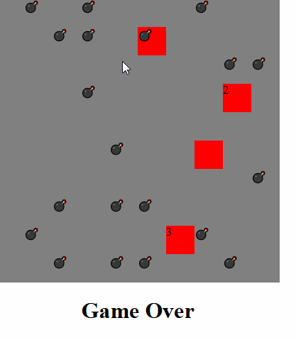

# 🚀 MineSweeper

> Simple Browser Based Mine Sweeper game

[](LICENSE)
[]()

---

## 📸 Demo / Screenshots

<p align="center">
  
</p>

---

## 📜 About

Simple Browser Based Mine Sweeper game

---

## 🛠 Tech Stack

**Frontend:** HTML, CSS, javascript
**Backend:** None
**Database:** None

---

## ⚙️ Installation

```bash
# Clone the repo
git clone https://github.com/Daneelv/Minesweeper.git

# Run locally
run with live server on vs code
```
